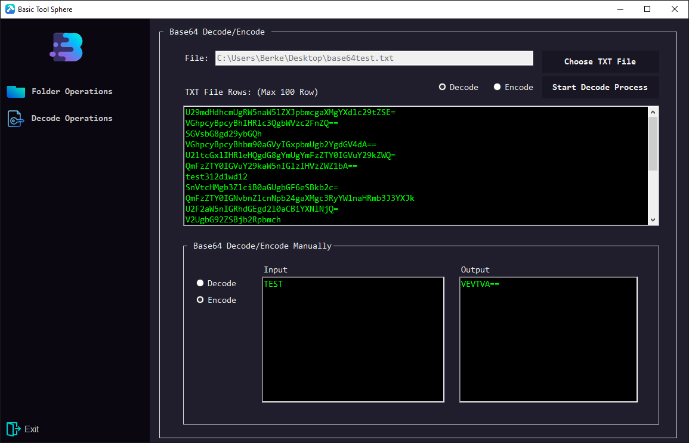
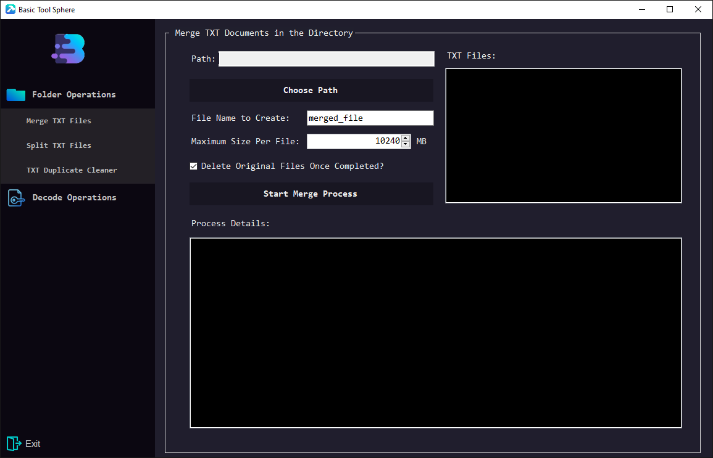

# 🌐 Basic Tool Sphere

**Basic Tool Sphere** is a versatile and user-friendly multi-tool application designed to simplify various text processing tasks. Whether you need to merge large `.txt` files, remove duplicate lines, or split massive documents into smaller chunks, this tool has you covered!

---

## ✨ Features

- ✅ **Remove Duplicate Lines** – Eliminate redundant lines from your text files effortlessly.  
- ✅ **Merge TXT Files** – Combine multiple `.txt` files into one large file.  
- ✅ **Split Large Files** – Break down big files into smaller, manageable parts.  
- ✅ **Dark-Themed Interface** – Sleek and modern UI for a better user experience.  

---

## 📸 Interface Preview

---

## 🚀 Getting Started

1. **Download** and install **Basic Tool Sphere**.
2. **Choose** the desired operation.
3. **Process** your files in just a few clicks.

---

💡 **Stay tuned for updates and new features!** 🎉

